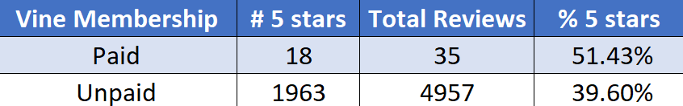
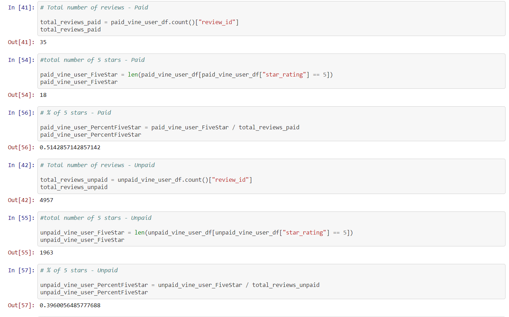

# Amazon_Vine_Analysis

# Overview

  -  The topline view was that we needed to analyze Amazon reviews written by members of the paid Amazon Vine program. We picked the major appliances dataset [one of the datasets from Amazon's S3 bucket](https://s3.amazonaws.com/amazon-reviews-pds/tsv/index.txt), used PySpark to perform the ETL process to extract the dataset, transformed the data, connected to an AWS RDS instance, and loaded the transformed data into pgAdmin. Then we used Pandas to determine if there was any bias toward favorable reviews from Vine members in the dataset. 

# Results for the Major Appliances Dataset

# Summary

